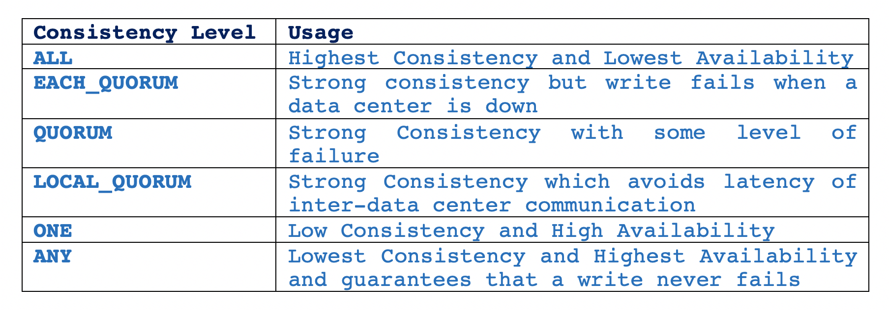

## Cassandra's Model of Consistency

Let's establish a few definitions before getting started:

* RF (Replication Factor): the number of copies of each data item
* R: the number of replicas that are contacted when a data object is accessed through a read operation
* W: the number of replicas that need to acknowledge the receipt of the update before the update completes
* QUORUM: sum_of_replication_factors/2 + 1, where sum_of_replication_factors = sum of all the replication factor settings for each data center

  
R + W > RF is a strong consistency model, where the write set and the read set always overlap.

But, configuring RF, R and W in this model, depends on the application for which the storage system is being used. In write-intensive application, setting W=1 and R=RF can affect durability in presence of failures as there is a possibility of conflicting writes. In read-intensive applications, setting W=RF and R=1 can affect the probability of the write succeeding.

So, to provide strong consistency and fault tolerance for balanced read-write requests, these two properties are appropriate:

* R + W > RF 
* R = W = QUORUM

For example, a system with configuration RF=3, W=2 and R=2.

R + W <= RF is a weak/eventual consistency model, where there is a possibility that the read and write set will not overlap and system is vulnerable to reading from nodes that have not yet received the updates.

  
### Read Request in Cassandra

Cassandra can send three types of read requests to a replica:

1. direct read request
2. digest request
3. background read repair request

The coordinator node sends one replica node with a direct read request and a digest request to a number of replicas determined by the consistency level specified by the client. These contacted nodes return the requested data and the coordinator compare the rows from each replica to ensure consistency. If all replicas are not in sync, the coordinator uses the replica that has the most recent data (based on timestamp) to forward the result back to the client. Meanwhile, a background read repair request is sent to out-of-date replicas to ensure that the requested data is made consistent on all replicas.

#### Examples of Read Consistency Levels

1. A single data center cluster with a consistency level of QUORUM 

  

2. A single data center cluster with a consistency level of ONE

  

3. A two data center cluster with a consistency level of QUORUM

  

4. A two data center cluster with a consistency level of LOCAL_QUORUM

  

5. A two data center cluster with a consistency level of LOCAL_ONE 

  

  

Table 1: Read Consistency Levels

### Write Request in Cassandra

The coordinator sends a write request to all replicas that own the row being written. As long as all replica nodes are available, they will get the write request regardless of the consistency level specified by the client. The write consistency level determines how many replica nodes must respond with a success acknowledgment in order for the write to be considered successful.

  

  

Table 2: Write Consistency Levels

