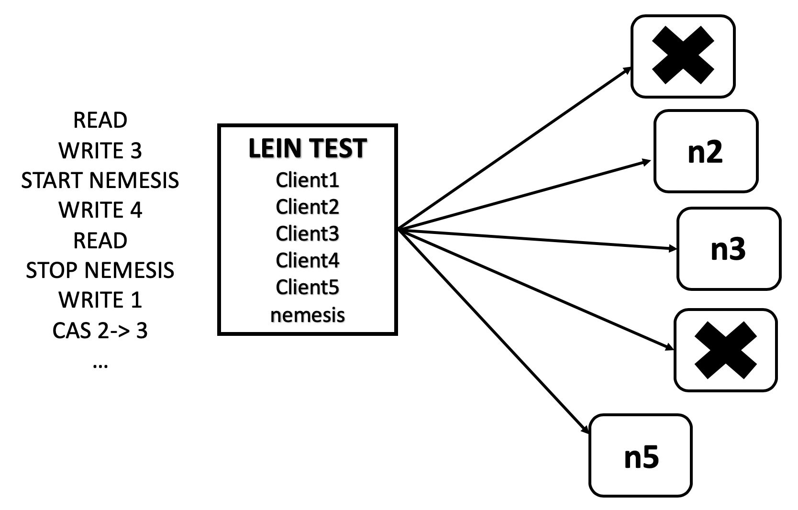
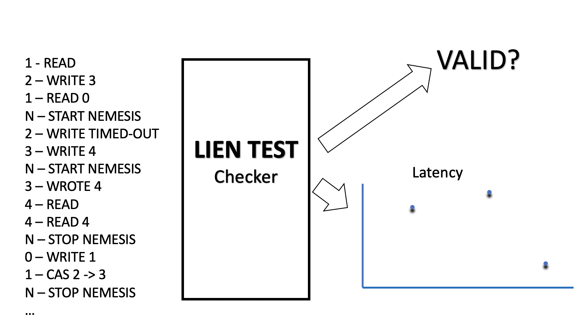

## Jepsen

Jepsen is an open source ‘clojure’ library, written by Kyle Kingsbury, designed to test the partition tolerance of distributed systems by fuzzing the systems with random operations. The results of these tests are analyzed to expose failure modes and to verify if the system violates any of the consistency properties it claims to have.

Jepsen test has three key properties:

1. <b>Generative</b>: relies on randomized testing to explore the state space of distributed systems
2. <b>Blackbox</b>: observes the system at client boundaries (does not need any tracing framework or apply some code patch in the distributed system to run the test)
3. <b>Invariance</b>: checks invariance from recorded history of operations rather than runtime

Jepsen Test Data Structure: 

~~~~
{:name                    ...| name of the results
 :os                      ...| prepares the operating system
 :db                      ...| configures/starts/stops the database being tested
 :client                  ...| client protocol to interact with database
 :generator               ...| instructs on how to interact
 :conductors{:nemesis  ...}  | interacts with the environment
 :checker              ...}  | looks at and assesses the test run
~~~~

### How a test runs?

1.	Orchestration node has one thread for each client and a thread for nemesis conductor
2.	A series of generated data comprising of read/write operations for client threads and crash/corrupt/partition operations for nemesis thread.
3.	N nodes on which Cassandra cluster is running.

4. A concurrent recorded history that explains the chronological behavior of the test. 
5.	Operations in the history are expressed as windows which marks the beginning and ending.
6.	After running the tests, the attached checker is executed, which produces judgement on the validity of the test or produces some artifacts to explain the result of the tests.

### Jepsen Analysis of Cassandra

#### Vector Clocks

Cassandra chose not to implement vector clocks because Vclocks require a read before each write. In order to speed up, Cassandra uses last-write-wins in all cases, thereby cutting down the number of round trips required for a write from 2 to 1. But, now the problem is that there is no safe way to modify column value. Instead of modifying a column, each distinct change is written to its own UUID-keyed column. Then, at read time, all the cells are read and a merge function is applied to obtain a result. This implies that order of writes is completely irrelevant. Any write made to the cluster could eventually wind up winning, if it has a higher timestamp.

Now, what happens if Cassandra sees two copies of a column with the same timestamp? <i>It picks the lexicographically bigger value.</i>

That means that if the values written to two distinct columns don’t have the same sort order, Cassandra could pick final cell values from different transactions. For instance, we might write {1,-1} and {2,-1}. 2 is greater than 1, so the first cell will be 2. But -1 is bigger than -2, so -1 wins in the second cell. The result? {2 -1}. In order for that to happen, you’d need two timestamps to collide. It’s really unlikely that two writes will get the same microsecond-resolution timestamp, right? I’ve never seen it happen in my cluster.

~~~~
10000 total
9899 acknowledged
9942 survivors
58 acknowledged writes lost! 		//writes lost means corrupt data
~~~~

It turns out that Cassandra is taking the current time in milliseconds and tacking on three zeroes to the end, calling it good. The probability of millisecond conflicts is significantly higher than microsecond conflicts, which is why we saw so much corrupt data.

Another example of this is during a read query, a coordinator node collects and compares digests (hash) of the data from replicas. If the digests mismatch, conflicts in the values are resolved using a latest timestamp wins policy. If there is a tie between timestamps, the lexically greatest value is chosen and installed on other replicas. If the corrupted value is lexically greater than the original value, the corrupted value is returned to the user and the corruption is propagated to other intact replicas. 

