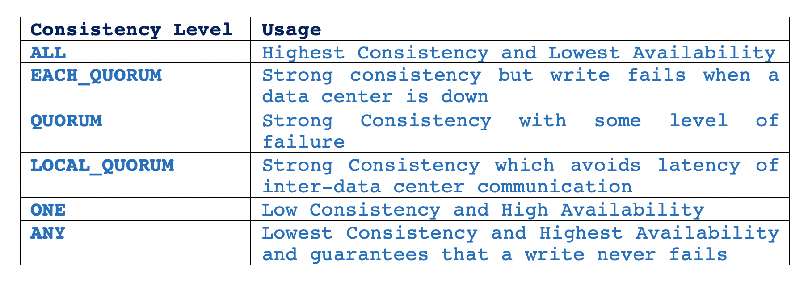

# Title
## Introduction

Today, all popular NoSQL databases like Cassandra, MongoDB or HBase claim to provide eventual consistency by offering tunable consistency. Reading this, the next question that comes to my mind is, What is consistency? In distributed systems, consistency defines rules for ordering and visibility of operations to multiple replicas regarding all the nodes in the cluster. For example, if row X is replicated on two replicas R1 and R2, client A writes row X to R1 and after a time period t, B reads row X from node R2. Then, the consistency model has to determine whether client B sees the write from client A or not.

    A strongly consistent system guarantees that all operations are seen in the same order by all the nodes in the cluster. This is hard to achieve, as it involves a lot of synchronization overhead which hampers availability and scalability, the key features of modern distributed systems. On the other hand, eventual consistency, also called optimistic replication is somewhat easier to achieve. It guarantees that if no updates are made to given data item, eventually all accesses to that item will return the last updated value, thereby providing high availability.

    Tunable consistency is where clients have the flexibility to adjust the consistency levels as per their needs, ranging from strong to eventual consistency. Cassandra offers support for per-operation(read/write) tradeoff between consistency and availability via varied 'Consistency Levels'. Basically, an operation’s consistency level specifies how many of the replicas need to respond to the coordinator node in order to consider the operation a success.

    In this blog post, I will explain Cassandra’s consistency levels, light weight transactions (LWT) which provide serial consistency, vector clocks and Jepsen analysis of distributed concurrency bugs in Cassandra.

## Cassandra's Model of Consistency

Let's establish a few definitions before getting started:

* RF (Replication Factor): the number of copies of each data item
* R: the number of replicas that are contacted when a data object is accessed through a read operation
* W: the number of replicas that need to acknowledge the receipt of the update before the update completes
* QUORUM: sum_of_replication_factors/2 + 1, where sum_of_replication_factors = sum of all the replication factor settings for each data center

  
R + W > RF is a strong consistency model, where the write set and the read set always overlap.

But, configuring RF, R and W in this model, depends on the application for which the storage system is being used. In write-intensive application, setting W=1 and R=RF can affect durability in presence of failures as there is a possibility of conflicting writes. In read-intensive applications, setting W=RF and R=1 can affect the probability of the write succeeding.

So, to provide strong consistency and fault tolerance for balanced read-write requests, these two properties are appropriate:

* R + W > RF 
* R = W = QUORUM

For example, a system with configuration RF=3, W=2 and R=2.

R + W <= RF is a weak/eventual consistency model, where there is a possibility that the read and write set will not overlap and system is vulnerable to reading from nodes that have not yet received the updates.

  
### Read Request in Cassandra

Cassandra can send three types of read requests to a replica:

1. direct read request
2. digest request
3. background read repair request

The coordinator node sends one replica node with a direct read request and a digest request to a number of replicas determined by the consistency level specified by the client. These contacted nodes return the requested data and the coordinator compares the rows from each replica to ensure consistency. If all replicas are not in sync, the coordinator uses the replica that has the most recent data (based on timestamp) to forward the result back to the client. Meanwhile, a background read repair request is sent to out-of-date replicas to ensure that the requested data is made consistent on all replicas.

<table>
    <thead>
        <tr>
            <th align="left">Consistency Level </th>
            <th align="left">Usage</th>
        </tr>
    </thead>
    <tbody>
        <tr>
            <td align="left">ALL</td>
            <td align="left">highest consistency and lowest availability</td>
        </tr>
        <tr>
            <td align="left">QUORUM</td>
            <td align="left">strong consistency with some level of failure</td>
        </tr>
        <tr>
            <td align="left">LOCAL_QUORUM</td>
            <td align="left">strong consistency which avoids inter-datacenter communication latency</td>
        </tr>
        <tr>
            <td align="left">ONE</td>
            <td align="left">lowest consistency and highest availability</td>
        </tr>
    </tbody>
</table>

Table 1: Read Consistency Levels

### Write Request in Cassandra

The coordinator node sends a write request to all the replicas that contain the row being written. As long as all replicas are available, they will get the write request regardless of the write consistency level specified by the client. The write consistency level determines how many replicas should respond with an acknowledgment in order for the write to be considered successful.

  

Table 2: Write Consistency Levels

